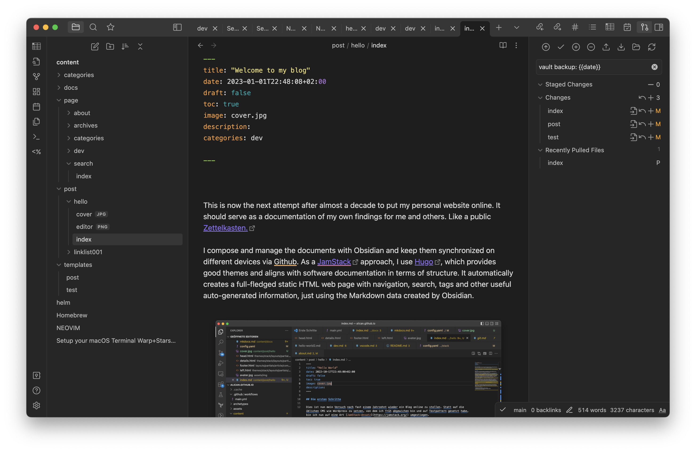

This is now the next attempt after almost a decade to put my personal website online. It should serve as a documentation of my own findings for me and others. Like a public [Zettelkasten.](https://de.wikipedia.org/wiki/Zettelkasten)

I compose and manage the documents with Obsidian and keep them synchronized on different devices via Github. As a [JamStack](https://jamstack.org/) approach, I use [Hugo](https://gohugo.io/), which provides good themes and aligns with software documentation in terms of structure. It automatically creates a full-fledged static HTML web page with navigation, search, tags and other useful auto-generated information, just using the Markdown data created by Obsidian.

## MkDocs vs Hugo

First I decided to use [MkDocs](https://www.mkdocs.org/). It is also a static site generator implemented in Python that you feed with Markdown documents, and it generates a HTML page. Configured in YAML and for the HTML templates the [Jinja engine](https://jinja.palletsprojects.com/en/3.1.x/) is used. With the help of community-made themes you can quickly get appealing web pages as a result. Probably the most popular theme is [Material for MkDocs ](https://squidfunk.github.io/mkdocs-material/). As the name suggests, it builds on the [Material theme](https://m2.material.io/design/) and offers quite useful plugins, such as search and social media cards. It also has a built-in [blog plugin](https://squidfunk.github.io/mkdocs-material/setup/setting-up-a-blog/#built-in-blog-plugin), but that is only usable by "Insiders". Insiders is [anyone who supports the developer with at least 15 euros a month](https://squidfunk.github.io/mkdocs-material/insiders/#what-is-insiders). The developer has certainly put a lot of work into it, but for a small private website this is a disproportionately high price.

Dissatisfied with this circumstance, I searched further and then discovered [Hugo](https://gohugo.io/). On this page you can find a list of many [Static Site Generetoren](https://jamstack.org/generators/) and can make yourself an impression of the large selection.

This webpages are, like said, static generated markdown documents that are generated from my github repository.
A push to the main branch triggers a github action that starts the [Hugo](https://gohugo.io/) static site generator, witch builds this whole website and puts the static html documents inside an own branch. I use the github webpage hosting service and my own domain to serve the html documents to the internet.

The benifits of this approach are simple.
As software developer you write texts for documentation in your favorite IDE and in Markdown, you don't have to break out of this routine when blogging and you don't have to log into any CMS and struggle with WYSIWYG editors.

In a nutshell:

* free webhosting through github pages
* Using git and markdown workflow to write/edit and deploy your content
* No maintenance for a CMS like wordpress, no security updates, no bugs, no hacks
* Third part contribution with pull requests

